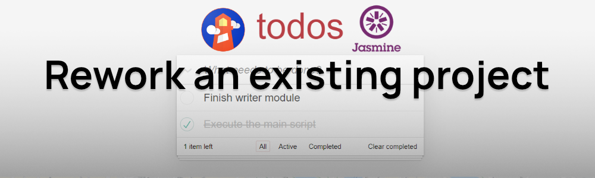
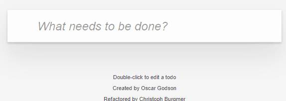
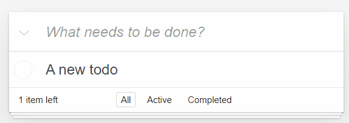
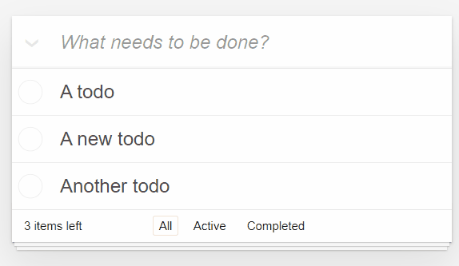
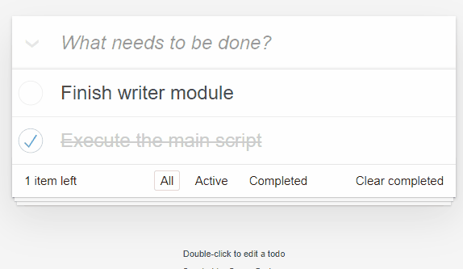

# todo-list-app

\
School project for [OpenClassrooms](openclassrooms.com).  
Take over and improve an existing project.

---



## Project

Forked from [tastejs/todomvc](https://github.com/tastejs/todomvc) with some  
adjustments from OpenClassrooms (e.g. to introduce bugs)

Description from original repo :

> Developers these days are spoiled with choice when it comes to selecting an MV\* framework for structuring and organizing JavaScript web apps.Backbone, Ember, AngularJS... the list of new and stable solutions goes on and on, but just how do you decide on which to use in a sea of so many options? To help solve this problem, we created TodoMVC - a project which offers the same Todo application implemented using MV* concepts in most of the popular JavaScript MV* frameworks of today.

### First step : Bug fixes

\
Some bugs were introduced and need to be fixed :

- A typo
- Eventual conflict with 2 identical IDs

**Soluce**

- Typo inside function name : `adddItem -> addItem` inside `controller.js`
- Either doing at ID generation a `do{}while()` to check if it is already used or using `new Date.time()` to get a new timestamp each time.

### Second step : Writing some tests

\
Tests added :

1. Should show entries on startup
1. Should show active entries for `#/active` routing
1. Should show completed entries for `#/completed` routing
1. Should highlight "All" filter by default
1. Should highlight "Active" filter when switching to active view
1. should toggle all todos to completed when clicking toggle all
1. should update the view when clicking toggle all
1. should add a new todo to the model when firing new todo event
1. should remove an entry from the model when firing remove event

### Third step : Optimize performance

\
Analyze a [concurrent site](http://todolistme.net/) to check what impact is performance. Prepare an audit for a potential scaling of our todolist.

<a href="./audit.pdf" rel="noreferrer noopener"  target="_blank">Check audit</a>

### Fourth step : Improve the project

\
Write docs showing :

- The project itself
- How it technically works
- Audit from 3rd step

You're reading it right now.

[Check the technical doc](https://docs-p8.danly.co/)

---

## Install

\
Note: you must have `npm` installed

Clone repository to your computer  
Go in cloned folder, then

```bash
npm install
```

## Usage

\
Open `index.html` in your favorite browser

\
App usage :

- Create a new todo by typing in the input field and then pressing Enter
  \
   
- Edit a todo by double-clicking it
  \
   
- Remove a todo by hovering over it to make the red cross appears, then click it
  \
   
- Toggle between complete state by checking the checkbox to the left
  \
   
- Toggle between complete state for every todos by clicking the down arrow to the left of the input field
  \
   
- Remove all completed todos by clicking the button at the bottom right
  \
   
- Use the navigation at the bottom to switch between views
  \
   

## Contributing

\
When contributing to this repository, please first discuss the change you wish to make via issue or email ([dev@danly.co](mailto:dev@danly.co)) before making a change.

### Pull Request Process

1. Ensure any install or build dependencies are removed before the end of the layer when doing a build.
2. Fill the pull request template.

### Contact

You can mail me at: [dev@danly.co](mailto:dev@danly.co)
If you like my work, please consider giving me a [star](https://github.com/danlybc)

---

\
_forked from_ [tastejs/todomvc](https://github.com/tastejs/todomvc)
